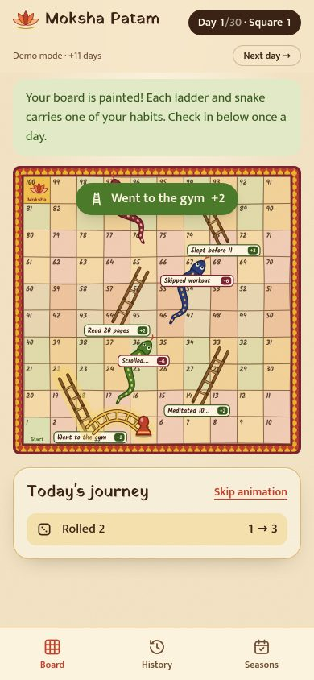
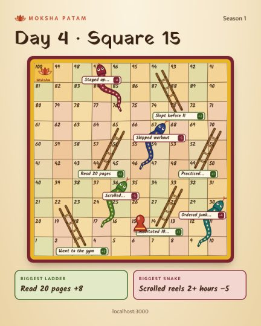

# Moksha Patam

A habit tracker played as the original Indian Snakes and Ladders. Your good habits are ladders, your bad habits are
snakes. Check in once a day, roll the dice, and try to reach square 100 — **Moksha** — within a 30-day season.

<p>
  
  
  
</p>

Mobile-first web app: Next.js (App Router) + TypeScript + Tailwind, Framer Motion animations, Supabase (magic-link
auth and Postgres), share cards with `next/og` (@vercel/og), deployable to Vercel.

## Features

- **Landing page** with the short story of Moksha Patam and a sample board.
- **Passwordless login**: Supabase magic link, plus a one-time code for links that open in another app.
- **Onboarding**: pick 3–6 good and 3–6 bad habits from suggestions or write your own (max 40 characters).
- **Hand-painted board**: warm colours, hand-drawn grid, bamboo ladders and patterned snakes, each labelled with your
  own habit and its length. Header shows the day and square.
- **Daily check-in**: toggle what you actually did, tap **Roll**. The dice tumbles, then each ladder and each snake
  plays one by one (a gold ladder or a snake is drawn from the pawn's square), then the final square.
- **Moksha** celebration when you reach square 100.
- **History**: every season, every day — rolls, ladders, snakes, and missed days.
- **Share card**: one tap renders a PNG (Instagram 1080×1350 or X 1200×675) with the board, the pawn,
  "Day 12 · Square 47" and your biggest ladder and snake; shared through the phone's share sheet or downloaded.
- **Seasons**: start a new 30-day season any time; past seasons stay in history.

## Game rules

| Rule | Default |
| --- | --- |
| Board | 10×10, squares 1–100, snaking left-right |
| Checking in | Roll one dice and move forward — showing up always moves you |
| Dice | 1–3 |
| Good habit done | Climb that habit's ladder. Doing **all** good habits climbs **8** squares in total, shared out between them (4 habits → +2 each) |
| Bad habit done | Slide down that habit's snake. Doing **all** bad habits slides **18** squares in total (4 habits → −5, −5, −4, −4) |
| Order | Dice, then ladders, then snakes, each from where the last one ended |
| Bottom | Never below square 1 |
| Top | Touching 100 is Moksha: the season is won and any remaining moves that day are skipped. Overshooting 100 counts as landing on it |
| Frequency | One check-in per day (in your time zone); a missed day just means no roll |
| Season | 30 days |

**Balance.** A player who does most good habits (75%) and few bad ones (25%) reaches Moksha in a median of **26–27
days** (about 72% finish within the season), whether they have 3 or 6 habits of each kind. Doing every good habit
and no bad ones wins in about 10 days; rolling alone can never win a season. The simulation in
`tests/domain/balance.test.ts` checks this on every `npm test`.

> The first brief suggested one dice 1–6, +5 per good habit and −4 per bad habit. With those numbers a typical
> player wins in about a week and the dice alone nearly wins a season (see the last two balance tests), so the
> defaults were tuned instead. Sharing a fixed total between habits keeps every board size equally fair.

### Tuning the numbers

Every number lives in one place: [`src/domain/rules.ts`](src/domain/rules.ts).

```ts
export const DEFAULT_RULES: GameRules = {
  seasonLengthDays: 30,
  diceFaces: 3,                              // dice rolls 1..3
  ladders: { mode: "split", fullDay: 8 },    // or { mode: "each", perHabit: 5 }
  snakes: { mode: "split", fullDay: 18 },    // or { mode: "each", perHabit: 4 }
  exactRollToWin: false,                     // true = classic rule, a move past 100 is cancelled
  habitsPerKind: { min: 3, max: 6 },
  maxHabitLabelLength: 40,
};
```

1. Change the numbers.
2. Run `npm test`. The balance tests fail if a typical player no longer reaches Moksha in 25–30 days, if the dice
   alone could win a season, or if a mostly-bad-habits player could win.
3. Adjust the targets in `tests/domain/balance.test.ts` if you deliberately want a different pace.

Each season stores a copy of the rules it started with, so tuning never rewrites past or current seasons — new
seasons pick up the new numbers. The database also enforces at most 6 habits of each kind and labels of up to 40
characters (the board has six ladder and six snake spots).

## Project structure

Clean architecture, with the dependencies pointing inwards (enforced by ESLint rules):

```
src/
  domain/            Pure TypeScript game rules — no framework imports
    rules.ts           every tunable number
    movement.ts        playDay(): dice → ladders → snakes, clamping, Moksha
    habits.ts          habit validation, ladder/snake lengths, suggestions
    season.ts          day numbers, one check-in per day, timeline incl. missed days
    board/             10×10 snaking geometry and the ladder/snake spots
    simulation.ts      seeded balance simulation
  application/       Use cases and ports (startSeason, checkIn, loadBoard, loadHistory, loadShareCard)
  infrastructure/    Supabase repository and typed schema, in-memory repository, crypto dice
  server/            Next.js wiring: env, Supabase clients, session, composition root, demo mode
  app/               Next.js routes (pages, server actions, /auth/confirm, /share/…, proxy)
  components/        Board art and animations, check-in, history, share sheet, habit picker
supabase/
  migrations/        Tables, row-level security, atomic write functions
  templates/         Magic-link email (works on any device, includes a one-time code)
tests/               Vitest: domain, application, SQL (PGlite), share-card rendering
```

## Getting started

Requires Node.js 20.9+.

```bash
npm install
cp .env.example .env.local
```

### Option A — try it without Supabase (demo mode)

```bash
DEMO_MODE=true npm run dev
```

Open http://localhost:3000, tap **Play the demo**. Data lives in memory, and a **Next day →** button in the header
lets you play through a whole season in minutes. Demo mode is for local development only.

### Option B — local Supabase (Docker)

```bash
npx supabase start          # starts Postgres, Auth and a mail catcher; applies supabase/migrations
npx supabase status         # shows the API URL, anon key and service_role key
```

Put the URL and keys in `.env.local`, then `npm run dev`. Sign-in emails appear in the local mail catcher at
http://127.0.0.1:54324. `supabase/config.toml` already sets the site URL, redirect URL and email template.

### Option C — hosted Supabase

1. Create a project at [supabase.com](https://supabase.com).
2. Apply the schema: `npx supabase link --project-ref <ref>` then `npx supabase db push`
   (or paste `supabase/migrations/*.sql` into the SQL editor).
3. **Authentication → URL Configuration**: set the Site URL to your app's URL and add `<your-url>/auth/confirm`
   (and `http://localhost:3000/auth/confirm` for local development) to the redirect URLs.
4. **Authentication → Email Templates**: paste `supabase/templates/magic-link.html` into both **Magic Link** and
   **Confirm signup**. Its link works even when the email is opened on another device or in a mail app's browser,
   and it includes a one-time code. (With Supabase's default template, links only work in the same browser.)
5. For real users, set up custom SMTP under **Authentication → SMTP** — the built-in email sender is heavily
   rate-limited.
6. Copy the URL and keys from **Project Settings → API** into `.env.local`.

### Environment variables

Secrets come from environment variables only (`.env.local` locally, the Vercel dashboard in production). Never commit
real keys.

| Variable | Where | Purpose |
| --- | --- | --- |
| `NEXT_PUBLIC_SUPABASE_URL` | browser + server | Supabase project URL |
| `NEXT_PUBLIC_SUPABASE_ANON_KEY` | browser + server | anon (or publishable) key; safe to expose |
| `SUPABASE_SERVICE_ROLE_KEY` | **server only** | service_role (or secret) key; used only to save check-ins and seasons |
| `NEXT_PUBLIC_SITE_URL` | server | public URL used in sign-in emails and on share cards (optional) |
| `DEMO_MODE` | server | `true` = in-memory demo without Supabase (local only) |

The newer `NEXT_PUBLIC_SUPABASE_PUBLISHABLE_KEY` / `SUPABASE_SECRET_KEY` names are accepted too.

## Deploy to Vercel

1. Push the repository to GitHub and import it in [Vercel](https://vercel.com/new) (Next.js is detected
   automatically).
2. Add the environment variables above for Production (and Preview if you use it). Leave `DEMO_MODE` unset. The
   Supabase integration in the Vercel marketplace can fill in the Supabase ones for you.
3. Deploy, then set the Supabase Site URL and redirect URL to the Vercel domain (step 3 of Option C).

Sign-in links point at the Site URL, so on preview deployments sign in with the one-time code from the email.

## Scripts

| Command | What it does |
| --- | --- |
| `npm run dev` | Development server (add `DEMO_MODE=true` to run without Supabase) |
| `npm test` | All tests (Vitest) |
| `npm run lint` | ESLint, including the architecture boundaries |
| `npm run typecheck` | Generates route types and runs TypeScript |
| `npm run build` / `npm start` | Production build and server |

## Tests

- **Domain** — every movement rule and edge case: rolling, below square 1, exactly 100, overshooting 100 (both
  rules), several habits in one day, Moksha skipping later moves, ladder/snake lengths, habit validation, time zones,
  one check-in per day, missed days, season timeline, and the balance simulation.
- **Application** — use cases against the in-memory repository with a test clock and scripted dice.
- **Database** — the real migration runs in [PGlite](https://pglite.dev) (Postgres in WebAssembly): atomic writes,
  one check-in per day, stale-state detection, row-level security and privileges.
- **Share card** — both formats render to PNGs of the exact size.

## Security model

- Dice are rolled on the server; the browser only animates the result.
- Players can read only their own rows (row-level security). Nobody can write from the browser: check-ins and new
  seasons are saved through two Postgres functions that only the service role may call, so squares and rolls can't
  be forged.
- Every write is atomic: one check-in per day per season, and a check-in based on an out-of-date pawn position is
  refused.
- Days follow the time zone captured from the browser when a season starts.

## Out of scope (for now)

Friends and leaderboards, AI features, push notifications, payments, native mobile apps.

## Credits

Fonts: Yatra One, Kalam and Mukta (SIL Open Font License), via Google Fonts.
